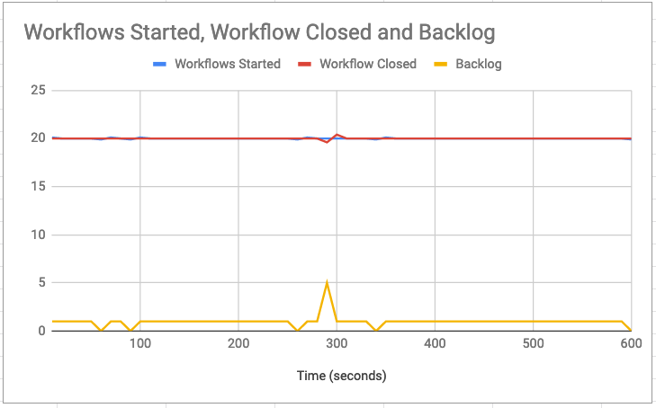

# Temporal Bench

Benchmarking tool for [Temporal](https://github.com/temporalio/temporal/) workflows.

## How It Works

This repository defines a Temporal workflow which serves as a driver for benchmarking tests. Given the definition
of a target load profile, the [`bench`](https://github.com/mikhailshilkov/temporal-bench/tree/master/workflows/bench)
workflow would drive the target load and collect the workflow execution statistics.

## Run the Bench Locally

The driver application reads the following environment variables to connect to a Temporal Server:

```
NAMESPACE=default
FRONTEND_ADDRESS=127.0.0.1:7233
NUM_DECISION_POLLERS=10
```

You will need to run the bench application, which also acts as a Temporal worker. Use the makefile to do so:

```bash
make run
```

## Deploy the Bench

The Bench workflow can be deployed to your target Temporal cluster, next to the workflows-to-be-benchmarked.
You can choose to benchmark your own workflows or use the included [`basic`](https://github.com/mikhailshilkov/temporal-bench/tree/master/workflows/bench)
workflow for starters.

The provided [Helm chart](https://github.com/mikhailshilkov/temporal-bench/tree/master/helm-chart) can help you deploy
the Bench application to your existing Kubernetes cluster.

The provided [Pulumi program](https://github.com/mikhailshilkov/temporal-bench/tree/master/pulumi) shows an example
of deploying a new Azure Kubernetes Cluster, the Temporal server, and the bench from scratch. This way, you can
easily experiment with running different sizes of Kubernetes clusters.

## Start a basic test using an input file

Once the bench worker and target workflows are running, you can start a quick test with the following command

```
tctl wf start --tq temporal-bench --wt bench-workflow --wtt 5 --et 1800 --if ./scenarios/basic-smoketest.json --wid 1
```

This command starts a basic Bench workflow which in turns runs the Basic workflow six times. If everything is configured correctly, you should be able to see those workflows in Web UI:


## Inspect the Bench Result

The Bench workflow returns the statistics of the workflow execution. Retrieve the result of the `bench-workflow` and you should see a block like

```
[
  "{Histogram:{Json:[{Started:6,Closed:6,Backlog:0}],Csv:Time (seconds);Workflows Started;Workflows Started Rate;Workflow Closed;Workflow Closed Rate;Backlog\\n60;6;0.100000;6;0.100000;0}}"
]
```

## Start a longer load test using an input file

Here is a sample test that runs a steady workload of 20 workflows per second for 10 minutes:

```
tctl wf start --tq temporal-bench --wt bench-workflow --wtt 5 --et 1800 --if ./scenarios/basic-10minutes.json --wid 2
```

It runs 12.000 workflows in total. The scenario also sets the reporting interval to 10 seconds, which means that the resulting report will have data points for every 10-second interval.

You can convert the workflow result to a chart like the one below using charting software of your choice:



